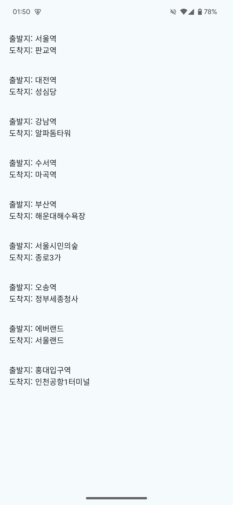
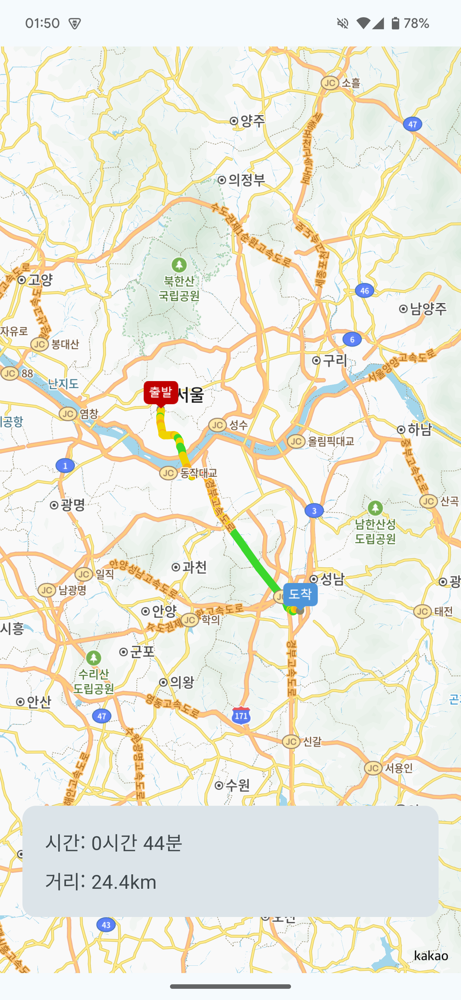

# 카카오모빌리티 주니어 개발자 Android Engineer 과제

## Project Structure
- Activity
	- MainActivity : Launcher Activity. 경로 목록이 보이는 화면입니다.
	- MapviewActivity : 특정 경로의 상세 정보를 확인하는 지도 화면입니다.
- Repository
	- RouteDetailRepository : 특정 경로의 좌표 정보를 다루는 Respository입니다.
	- RouteInfoRepository : 특정 경로의 시간/거리 정보를 다루는 Repository입니다.
	- RouteListRepository : 전체 경로 목록을 다루는 Repository입니다.

## How to Build
1. Android Studio를 통해 본 프로젝트를 Open 합니다.
2. `local.properties`에 다음과 같이 3개 환경변수를 지정합니다.
	```
	# Example
	API_KEY=12341234
	API_URL=https://api.xxx.com
	KAKAO_SDK_KEY=12341234
	```
	> API_KEY : API 서버에 접근하기 위한 API 키 값입니다.<br/>
	> API_URL : API 서버의 Base URL 값입니다.<br/>
	> KAKAO_SDK_KEY : 카카오맵 SDK에 연동하기 위한 Native App 키 값입니다.
3. Gradle Sync 후 Build 합니다.

## Architecture
MVVM 및 Repository 패턴을 활용한 아키텍쳐를 적용하였습니다.<br/>
각 Activity는 연동된 ViewModel을 통해 LiveData 형식으로 데이터를 구독해 State 기반의 UI 렌더링을 처리합니다.<br/>
각 ViewModel은 지정된 Repository를 통해 API 서버로부터 데이터를 받아와 저장합니다.<br/>
API 서버의 호출은 `Retrofit2` 라이브러리를 기반으로 이루어지며, Model Data Class 및 `ApiUtil`을 기반으로 데이터를 구성합니다. <br/>
네트워크 상태 혹은 API 서버에서의 오류에 따른 처리는 내부적으로 이루어지며, UI상에 Text를 통해 전시됩니다.<br/>
API 호출을 위한 `Retrofit2` 인스턴스를 관리하는 `ApiUtil` 및 디버깅 로그를 위한 `LogUtil`, 네트워크 상태 확인을 위한 `NetworkUtil`은 Singletone 형식으로 정의되어 소스코드에서 활용됩니다.

## Directory Structure [Kotlin]
- `com/yong/km_assignment` : 프로젝트의 최상위 Package입니다.
- `com/yong/km_assignment/data/api` : API 호출을 위한 `Retrofit2` 인터페이스가 위치합니다.
- `com/yong/km_assignment/data/model` : 데이터 Model 클래스가 위치합니다.
- `com/yong/km_assignment/data/repository` : 데이터 Repository 클래스가 위치합니다.
- `com/yong/km_assignment/ui/main` : MainActivity 및 ViewModel 클래스가 위치합니다.
- `com/yong/km_assignment/ui/mapview` : MapviewActivity 및 ViewModel 클래스가 위치합니다.
- `com/yong/km_assignment/ui/theme` : 애플리케이션 전역의 Theme 소스코드가 위치합니다. Color 등의 속성을 정의하였습니다.
- `com/yong/km_assignment/util` : 각종 Util 클래스가 위치합니다.

## Screenshots
<div style="display: flex; flex-direction: row; justify-content: space-evenly">
	
	
	
</div>

## Library
- [AndroidX Compose](https://developer.android.com/jetpack/androidx/releases/compose)
- [Kakao Map SDK V2](https://apis.map.kakao.com/android_v2/)
- [Retrofit2](https://square.github.io/retrofit/)

## Permissions
- `android.permission.ACCESS_NETWORK_STATE` : 네트워크 연경 상태에 따른 예외처리에 사용됩니다.
- `android.permission.INTERNET` : API 서버와의 통신을 위해 사용됩니다.

## 개발자

[유용민](https://github.com/yymin1022) | 중앙대학교 소프트웨어학부 (2025. 02. 졸업예정)
